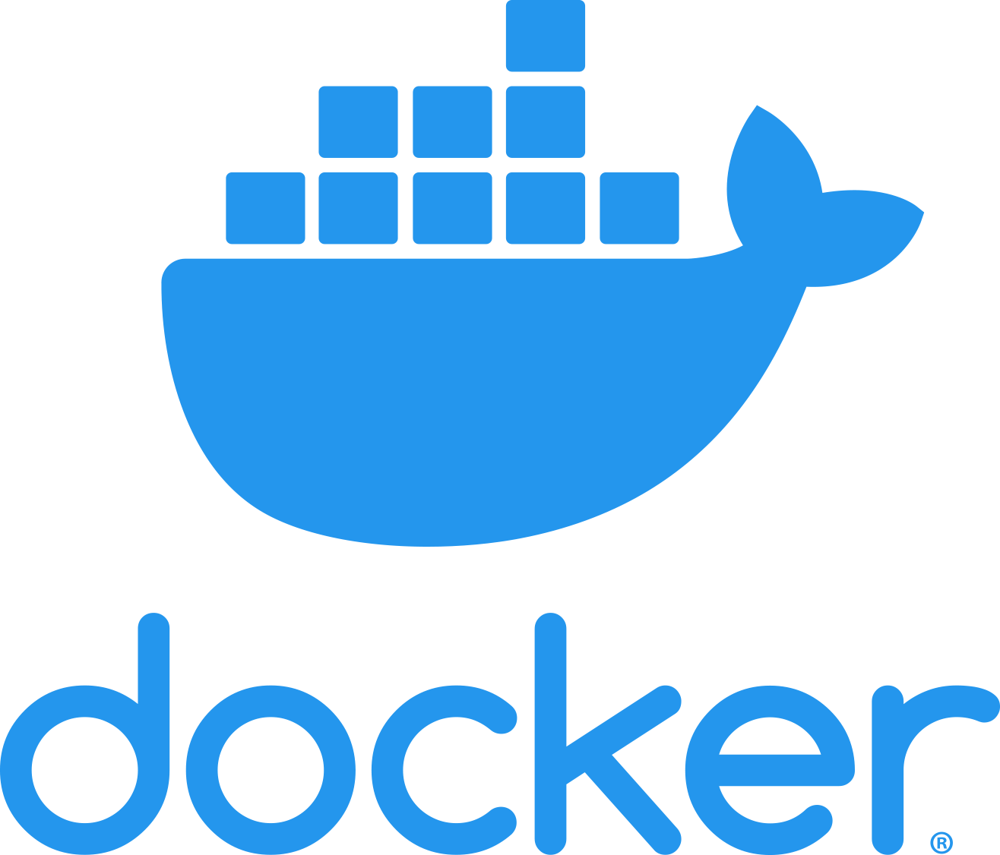
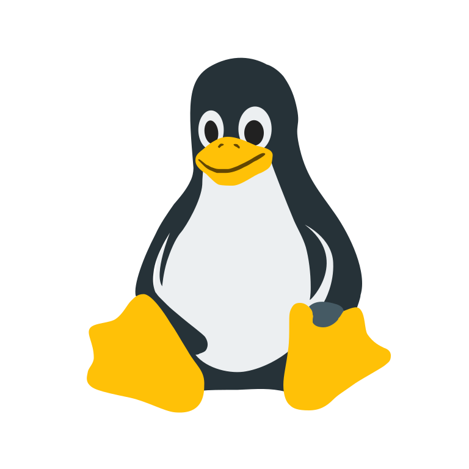
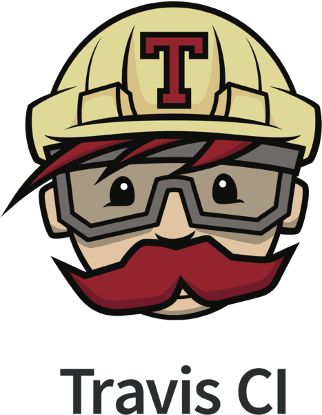

   

<table>
 <tr>
<td align="center"><a href="./Container-orchestration/Docker"> <b>Docker</b></a> <a href="./Container-orchestration/Docker/docker-concepts.md">Docker Concepts</a> <a href="./Container-orchestration/Docker/docker-notes.md">Docker Notes</a> <a href="./Container-orchestration/Docker">Docker Tutorial</a></td>
     <td align="center"><a href="./Container-orchestration/kubernetes"> <b>Kubernetes</b></a> <a href="./Container-orchestration/kubernetes/kuber-concepts.md">Kubernetes Concepts</a> <a href="./Container-orchestration/kubernetes/kubernetes-commands.md">Kubernetes Commands</a></td>
    <td align="center"><a href="./CI-CD/git"> <b>Git</b></a> <a href="./CI-CD/git">Git concepts</a> <a href="./CI-CD/git/git-advanced.md">Git Advanced</a></td>
    <td align="center"><a href="./CI-CD/jenkins"> <b>Jenkins</b></a> <a href="./CI-CD/jenkins/jenkins-concepts.md">Jenkins Concepts</a> <a href="./CI-CD/jenkins/jenkins-tutorials.md">Jenkins Tutorials</a></td>
  </tr>
   
   
 </table>

   

<table>

   <tr>
    <td align="center"><a href="./OS"> <b>Linux</b></a> <a href="./OS/os-concepts.md">OS/Linux-Concepts</a> <a href="./OS/os-commands.md">Linux Commands</a></td>
     <td align="center"><a href="./Networking"> <b>Networking</b></a> <a href="./Networking/networking-concepts.md">Networking Concepts</a> <a href="./Networking/networking-commands.md">Networking Commands</a></td>

  </tr>
  
 </table>

 

<table>

   <tr>
    <td align="center"><a href="./CI-CD/TravisCi"> <b>Travis</b></a> <a href="./CI-CD/TravisCi/travis-concepts.md">Travis Concepts</a> <a href="./CI-CD/TravisCi/travis-commands.md">Travis Commands</a></td>
    <td align="center"><a href="./CI-CD/Actions"> <b>GitHub Actions</b></a> <a href="./CI-CD/Actions/github-actions-concepts.md">Actions Concepts</a> <a href="./CI-CD/Actions/github-actions-tutorial.md">Actions Tutorial</a></td>
  </tr>
  
 </table>

---

### Getting Started DevOps Links:

- [What is Devops - AWS](https://aws.amazon.com/devops/what-is-devops/)
- [DevOps Roadmap by kamranahmedse](https://github.com/kamranahmedse/developer-roadmap/blob/master/img/devops.png)
- [Devops Roadmap by Nguyen Truong Duong](https://github.com/raycad/devops-roadmap)
- [Roadmap To devops](https://medium.com/faun/the-roadmap-to-become-a-devops-dude-from-server-to-serverless-dd97420f640e)
- [r/devops](https://www.reddit.com/r/devops/)
- [IBM Kubernetes Handson Labs](https://github.com/IBM/kube101/tree/master/workshop)
- [Getting Started With Azure DevOps](https://github.com/microsoft/azuredevopslabs)
- [Getting started with Google Cloud Platform](https://cloud.google.com/gcp/getting-started/)
- [Freecodecamp Devops Getting Started Articles](https://www.freecodecamp.org/news/tag/devops/)
- [The-devops-roadmap-for-programmers](https://dzone.com/articles/the-devops-roadmap-for-programmers)
- [DevOps Getting Started](https://medium.com/@devfire/how-to-become-a-devops-engineer-in-six-months-or-less-366097df7737)
- [How-to-get-started-with-devops](https://dev.to/liquid_chickens/how-to-get-started-with-devops)
- [Going-from-it-to-devops](https://medium.com/better-programming/going-from-it-to-devops-996192520331)

---

## To Do

- [ ] Add More Notes on OS/Linux
- [ ] Add more concepts of CI/CD
- [ ] Add more interview Question about OS and Networking
- [ ] Kubernetes Monitoring - Prometheus and Grafana
- [ ] Add IaC concepts and Tools
- [ ] Add - AWS CloudFormation,Terraform,Chef,Ansible,Puppet
- [ ] Helm - charts

---

## License

This project is licensed under the MIT License - Copyright (c) 2019 Tikam Alma
